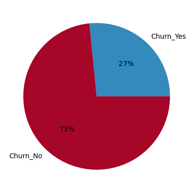
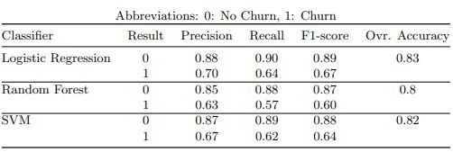
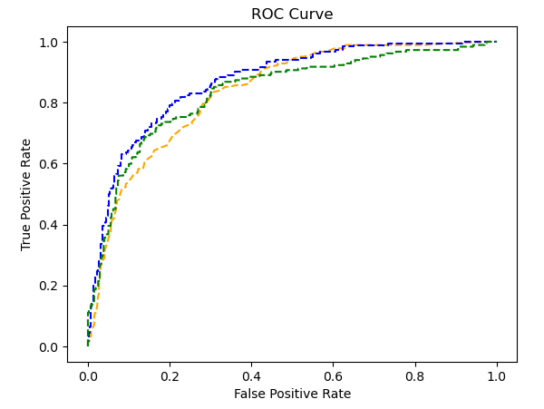

# Customer Churn Analysis

Data science project that predicts customers who are likely to churn using Telco data.

## Code and Packages

**Python version:** 3.9.13

**Packages:** Pandas, Numpy, Sklearn, Matplotlib, Seaborn

## EDA

In this step I did data exploration to better understand the dataset. To check the results open the eda.ipynb

## Examined Models 

The models used for this project are:
- Logistic Regression
- Support Vector Machines
- Random Forest

To evaluate the model results I used **precision, recall, accuracy, F1-score and AUC score.**

## Feature Selection 

Since I had 44 features to train the models I performed a feature selection algorithm. The methods I compared in order to pick the most suitable one were the following:
- Principal Component Analysis
- Recursive Feature Elimination

I chose to proceed with RFE because it provided me with better accuracy.

## Class Imbalance Solution

Telco dataset is highly imbalanced. To fix this problem I performed ADASYN overasampling to the minority class. The picture below shows the classes distribution before oversampling.

  

## Results

The table below shows the results for each classifiers when it comes to precision, recall, F1-Score and accuracy.

  

Logistic Regression outperformed the other classifiers in all metrics.

I also plotted the ROC Curve for each classifier. The blue line is for Logistic Regression, the orange line for Random Forest and the green line for SVC. 

  

